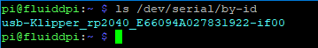

# [切换到中文版](./README_zh_cn.md)

# How to use Klipper on SKR Pico V1.0

## Pinout
### Raspberry pi pinout
<br/>

### SKR Pico V1.0 pinout
<br/>

## Wiring diagram
### Raspberry pi is powered by an external +5V adapter and communicates with SKR Pico V1.0 via USB
<br/>

### Raspberry pi is powered by the motherboard +5V and communicates with SKR Pico V1.0 via UART
<br/>

## Build Firmware Image

1. Precompiled firmware(The source code version used is [Commits on Dec 13, 2021](https://github.com/Klipper3d/klipper/commit/323268ea02700b2fd3b6accda310845ba29c894e))
   * [klipper-USB.uf2](./klipper-USB.uf2) Use USB to communicate with raspberry pi. Connect the type-A USB of raspberry pi with the type-C of motherboard directly to communicate normally.
   * [klipper-UART0.uf2](./klipper-UART0.uf2) Use UART0 to communicate with raspberry pi. Connect the UART-TX of raspberry pi with the UART-RX0 of motherboard and connect the UART-RX of raspberry pi with the UART-TX0 of motherboard directly to communicate normally.

2. Build your own firmware<br/>
   1. Refer to [klipper's official installation](https://www.klipper3d.org/Installation.html) to download klipper source code to raspberry pi
   2. `Building the micro-controller` with the configuration shown below.
      * [*] Enable extra low-level configuration options
      * Micro-controller Architecture = `Raspberry Pi RP2040`
      * IF USE USB
         * Communication interface = `USB`
      * ElSE IF USE UART0
         * Communication interface = `Serial (on UART0 GPIO1/GPIO0)`

      <br/>
   3. Once the configuration is selected, press `q` to exit,  and "Yes" when  asked to save the configuration.
   4. Run the command `make`
   5. The `klipper.uf2` file will be generated in the folder `home/pi/kliiper/out` when the `make` command completed. And you can use the windows computer under the same LAN as raspberry pi to copy `klipper.uf2` from raspberry pi to the computer with `pscp` command in the CMD terminal. such as `pscp -C pi@192.168.0.101:/home/pi/klipper/out/klipper.uf2 c:\klipper.uf2`(The terminal may prompt that `The server's host key is not cached` and ask `Store key in cache?((y/n)`, Please type `y` to store. And then it will ask for a password, please type the default password `raspberry` for raspberry pi)

## Firmware Installation

1. You can use the method in [Build Firmware Image 2.5](#build-firmware-image) or use a tool such as `cyberduck` or `winscp` to copy the `klipper.uf2` file from your pi to your computer.
2. Insert a jumper on the `Boot` pins of the motherboard and click the `Reset` button to enter the burn mode (Note: If you want to use USB to power the motherboard, you need to insert a jumper on `USB Power`. When there is 12V / 24V power supply, it is best to remove the jumper)
   <br/>
3. Connect USB-C to computer, then you will see a USB flash drive named `RPI-PR2`, copy `klipper-USB.uf2`, `klipper-UART0.uf2` provided by us or `klipper.uf2` compiled by yourself to the USB flash drive, the motherboard will automatically reboot and update the firmware, the computer will re-identify this USB flash drive means the firmware update
is complete, unplug the `boot jumper` and click the `Reset` button to enter normal working mode
   <br/>
4. you can confirm that the flash was successful, by running `ls /dev/serial/by-id`.  if the flash was successful, this should now show a klipper device, similar to:

   

   (note: this test is not appicable if the firmware was compiled for UART, rather than USB)

## Configure the printer parameters
### Basic configuration
1. Refer to [klipper's official installation](https://www.klipper3d.org/Installation.html) to `Configuring OctoPrint to use Klipper`
2. Refer to [klipper's official installation](https://www.klipper3d.org/Installation.html) to `Configuring Klipper`. And use the configuration file [SKR Pico klipper.cfg](./SKR%20Pico%20klipper.cfg) as the underlying `printer.cfg`, which includes all the correct pinout for SKR Pico V1.0
3. Refer to [klipper's official Config_Reference](https://www.klipper3d.org/Config_Reference.html) to configure the features you want.
4. If you use USB to communicate with raspberry pi, run the `ls /dev/serial/by-id/*` command in raspberry pi to get the correct ID number of the motherboard, and set the correct ID number in `printer.cfg`. And wiring reference [here](#raspberry-pi-is-powered-by-an-external-5v-adapter-and-communicates-with-skr-pico-v10-via-usb)
    ```
    [mcu]
    serial: /dev/serial/by-id/usb-Klipper_rp2040_E66094A027831922-if00
    ```
5. If you use UART0 to communicate with raspberry pi, you need to modify the following files by inserting the SD card into the computer or by SSH command. And wiring reference [here](#raspberry-pi-is-powered-by-the-motherboard-5v-and-communicates-with-skr-pico-v10-via-uart)
   * Remove `console=serial0,115200` in `/boot/cmdline.txt`
   * Add `dtoverlay=pi3-miniuart-bt` at the end of file `/boot/config.txt`
   * Modify the configuration of `[mcu]` in `printer.cfg` to `serial: /dev/ttyAMA0` and enable `restart_method: command` by SSH
     ```
     [mcu]
     serial: /dev/ttyAMA0
     restart_method: command
     ```
